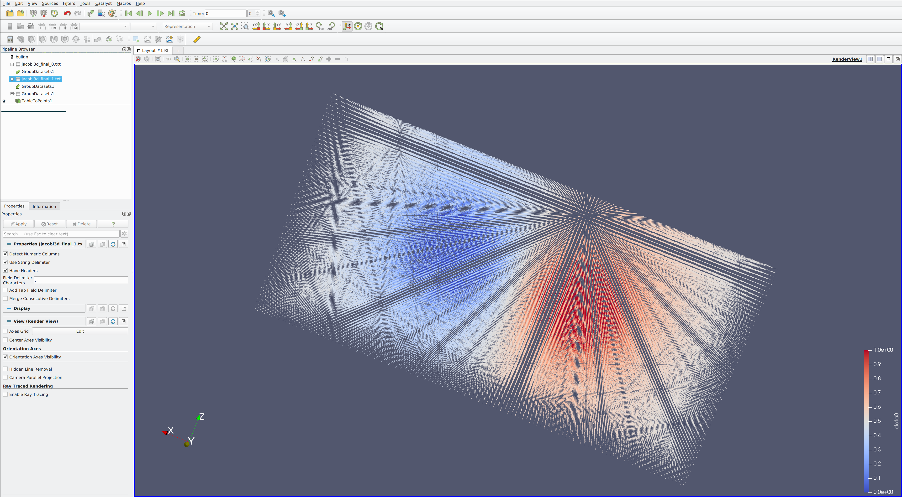

# stencil

[](https://travis-ci.com/cwpearson/stencil)

A prototype MPI/CUDA stencil halo exchange library

## Quick Start

Install MPI, CUDA, and CMake 3.17+, then

```
git clone git@github.com:cwpearson/stencil.git
cd stencil
mkdir build
cd build
cmake ..
make
make test
```

## Design Principles

* Maximal communication overlap: each GPU communicates with neighbors in a point-to-point scheme with all communication overlapped
* Fast intra-node communication: communication can occur entirely through CUDA even for different ranks on the same node.
* CUDA-aware MPI support: Can be enabled if desired (`cmake -DUSE_CUDA_AWARE_MPI=ON`)
* Automatic partitioning: partition data to minimize communication volume
* Topology-aware data placement: place data to maximize communication bandwidth for large messages
* Communication/Computation Overlap: API to query grid regions that can be used concurrent with communication.
* Friendly: Access data in terms of grid coordinates, not memory offsets.

## Documentation

`stencil` optimized communication with CUDA, NUMA, and MPI, depending on whether those are available in the environment.
Depending on availability, the following compiler defines exist:

| Capability | Available | Not Available |
|-|-|-|
| MPI | `STENCIL_USE_MPI=1` | `STENCIL_USE_MPI=0` |
| CUDA | `STENCIL_USE_CUDA=1` | `STENCIL_USE_CUDA=0` |

## Requirements
Tested on

* CUDA 10.1 / 10.2 / 11.0
* OpenMPI 2.1

## Using different MPIs

Create a toolchain file, like `cmake/toolchains/deneb-openmpi-4.0.5.cmake`

clear your build directory, and invoke CMake like this
```
cmake -DCMAKE_TOOLCHAIN_FILE=../cmake/toolchains/deneb-openmpi-4.0.5.cmake ..
```


## Tests

Install MPI and CUDA, then

```
make && make test
```

To run specific tests
```
test/test_cpu "<case name>" -c "<section name>"
```
With `USE_CUDA_GRAPH=ON`, errors may be reported inconsistently, very late, or be nonsense (e.g., `715 invalid instruction` when a stream was on a wrong device).
Using a newer CUDA version can improve aspects of error reporting.
If there is an error, it probably indicates an actual problem, just not necessarily the problem CUDA reports.

It may be useful to run tests under `cuda-memcheck`.
`cuda-memcheck` may report spurious errors from `cudaDeviceEnablePeerAccess`, so we disable reporting API errors.
All API calls are checked at runtime at all optimization levels, so errors will always surface.
With `USE_CUDA_GRAPH=ON`, `cuda-memcheck` may not report errors.
```
cuda-memcheck --report-api-errors no test/test_cuda
```

Some tests are tagged:

MPI tests only
```
test/test_all "[mpi]"
```

CUDA tests only
```
test/test_all "[cuda]"
```

## Profiling with nsys

With the default profiling settings, we sometimes see a crash on Nsight Systems 2019.3.7 on amd64.
Restrict profiling to CUDA, NVTX, and OS calls.

```
nsys profile -t cuda,nvtx,osrt mpirun -n <int> blah
```

to enable IP sample, backtrace, and scheduling data collection
```
sudo sh -c 'echo 1 >/proc/sys/kernel/perf_event_paranoid'
```

Use the Nsight Systems application to view the resulting `qdrep` file.

Make sure your `nsight-sys` version at least matches the `nsys` version used to collect the profile.

### 2019.5.2

Nsight Systems 2019.5.2 allows `-t mpi`, but on amd64 it causes the importer to hang.

### 2020.1.1

```
nsys profile -t nvtx,cuda,mpi mpirun -n <int> blah
```

## Profiling with nvprof

```
mpirun -n <int> nvprof -o timeline_%p.nvvp ...
```

To mount a remote directory (where there are nvprof files to load):
```
sshfs -o IdentityFile=/path/to/id_rsa user@host:/path /mount/location
```
## Choosing a different MPI

```
cd build
rm -f CMakeCache.txt
cmake -DCMAKE_PREFIX_PATH=path/to/mpi ..
```

`mpiexec` from the MPI will be soft-linked into the build directory for convenience
This mpiexec should be used to launch any binaries.

```
./mpiexec -n 2 bin/<exe>
```

## MCA Parameters

Setting an MCA param
```
mpirun --mca mpi_show_handle_leaks 1 -np 4 a.out
```

Checking for CUDA-Aware MPI support:
```
ompi_info --parsable --all | grep mpi_built_with_cuda_support:value
```

## Bulding OpenMPI 4.0.5 with CUDA

```
./configure --prefix="blah" --with-cuda=/path/to/cuda
```

## Building Mvapich 2.3.4 with CUDA
```
apt-get install bison
./configure --prefix="blah: --enable-cuda --with-cuda=/path/to/cuda
```

may need a quick patch for CUDA 11:
```
src/mpid/ch3/channels/mrail/src/gen2/ibv_cuda_util.c:844:37: error: ‘struct cudaPointerAttributes’ has no member named ‘memoryType’
  844 |                 is_dev = (attributes.memoryType == cudaMemoryTypeDevice) ? 1 : 0;
```

the struct member should be `attributes.type`

may also need

```
--disbale-mcast --enable-fortran=no
```

Run with `MV2_USE_CUDA=1`.

## Building MPICH 3.4a3 with CUDA

```
./configure --prefix="blah" ---with-device=ch4 -with-ch4-shmmods=gpudirect
```

uncertain of the difference between `ch4` and `ofi`.

may also need

```
--enable-fortran=no
```

## On NCSA Hal

Run scripts are in `scripts/hal`

```
srun --partition=gpu --time=4:00:00 --ntasks=2 --nodes=2 --ntasks-per-node=1 --sockets-per-node=1 --cores-per-socket=8 --threads-per-core=4 --mem-per-cpu=1200 --wait=0 --export=ALL --gres=gpu:v100:2 --pty /bin/bash
```

SpectrumMPI with CUDA-Aware MPI

```
module load spectrum-mpi
cmake .. -DUSE_CUDA_AWARE_MPI=ON
make
```

Show reservations: `scontrol show res`

Show queue: `swqueue`

## On OLCF Summit

Suggest using the latest version of CUDA:`module load cuda/11.0.3`.
Earlier versions work but have poor error reporting from CUDA graphs and cannot overlap CUDA graph execution and data transfer.

Run scripts are in `scripts/summit`.

nsight-systems 2020.3.1.71 can crash with the `osrt` or `mpi` profiler turned on.
Disable with `nsys profile -t cuda,nvtx`.

To control the compute mode, use `bsub -alloc_flags gpudefault` (see https://www.olcf.ornl.gov/for-users/system-user-guides/summitdev-quickstart-guide/#gpu-specific-jobs)

To enable GPUDirect, do `jsrun --smpiargs="-gpu" ...` (see https://docs.olcf.ornl.gov/systems/summit_user_guide.html, "CUDA-Aware MPI")

To run tests, do `bsub 1node_test.sh` or get an interactive node (`bsub -W 2:00 -q debug -nnodes 1 -P csc362 -alloc_flags gpudefault -Is /bin/zsh`) and run that script.

During configuration, you may see an error like this which causes cmake to fail:
```
CMake Error: Remove failed on file: /ccs/home/cpearson/repos/stencil/build/CMakeFiles/CMakeTmp/CMakeFiles/cmTC_50eb9.dir/.nfs000000001473310900000eaf: System Error: Device or resource busy
```
Re-run cmake again.

* [jsrunvisualizer](jsrunvisualizer.olcf.ornl.gov)
* [job-step-viewer](https://jobstepviewer.olcf.ornl.gov)
* [jsrun arguments](https://docs.olcf.ornl.gov/systems/summit_user_guide.html#launching-a-job-with-jsrun)

## ParaView (5.8.0)



First, get some paraview files: for example, `mpirun -n 2 bin/jacobi3d 60 60 60 --paraview --iters 1000`.

* `File` > `Open`. Open individually, not as a group
  * Select the delimiters, then hit apply on the `Properties` tab of the Pipeline Browser. `,` is the delimiter used by this library.
* Group the files into a single dataset.
  * Select the two files, then `Filters` > `Common` > `Group Datasets`.
  * `Apply`. This will create a new combined GroupDatasets1 in the pipeline browser.
* Select the dataset and `Filters` > `Alphabetical` > `Table to Points`
  * Select the x,y,z columns in the `Properties` tab
  * Click on the vizualization window
  * `Apply`
* In the `Coloring` section of the `Properties` tab, choose the name of the data field.

## Astaroth Simulator

Experimental implementation of the sataroth code using this library for halo exchange.

* `mpirun -n <N> astaroth/astaroth`

The astaroth configuration is defined in `astaroth/astaroth.conf`

## Design Goals
  * v1 (iWAPT)
    * [x] joint stencils over multiple data types (Astaroth)
    * [x] uneven partitioning
    * [x] edge communication (Astaroth)
    * [x] corner communication (Astaroth)
    * [x] face communication (Astaroth)
    * [x] overlap MPI and CUDA
    * [x] Same-GPU halo exchange with kernels
    * [x] Same-rank halo exchange with kernels
    * [x] Same-rank halo exchange with `cudaMemcpyPeer`
    * [x] co-located MPI rank halo exchange with with `cudaIpc...` and `cudaMemcpyPeer`
    * [x] automatic data placement in heterogeneous environments
    * [x] Control which GPUs a distributed domain should use
      * `DistributedDomain::use_gpus(const std::vector<int> &gpus)` 
    * [x] Control which exchange method should be used
  * v2 (next publication)
    * [x] ParaView output files `DistributedDomain::write_paraview(const std::string &prefix)`
    * [x] support uneven radius
    * [x] "Accessor Object" for data
      * [x] Index according to point in compute domain
    * [x] Support overlapped computation and communication
      * interface for extracting interior/exterior of compute region for kernel invocations
    * [x] `cudaMemcpy3D`
    * [x] CUDA runtime timer
    * [x] pitched allocation
    * [ ] sort communication for weak scaling?
  * v3
    * [ ] Message bundling
      * Improved performance by sending all data for a remote node in a single message?
    * [ ] allow a manual partition before placement
      * constrain to single subdomain per GPU
  * future work
    * [ ] Autodetect CUDA-Aware MPI support
      * testing at build time with `ompi_info`
      * `MPI_T_cvar_read` / `MPI_T_cvar_get_info` ?
    * [ ] N-Dimensional data 
      * with [cuTensor](https://docs.nvidia.com/cuda/cutensor/index.html)?
    * [ ] selectable halo multiplier
      * fewer, larger messages and less frequent barriers
      * larger halo allocations
    * [ ] factor out placement solver code

    
* needs info
  * [ ] exchange subset of quantities
    * this would potentially split some of the operation bundling opportunities (pack, CUDA graph, ...)
    * exchange is not async now, e.g. CPU polls communicators. May want a worker thread or something.
  * mesh refinement
    * we would rely on the user to specify the conditions
    * inferface for asking for refinement?
    * how to rebalance load and communication
    * would require test machine with non-homogeneous intra-node communication
  * mapping multiple subdomains to each GPU
* wontfix
  * [ ] Non-rectangular regions
    * probably getting to close to a general task-based runtime at that point (like Legion)
  * [ ] Remove requirement of CUDA (HPCG)
    * research vehicle for CUDA + MPI


## Interesting Things

### Reference-Counted Resource Manager for CUDA Streams

`include/stencil/rcstream.hpp`

A C++-style class representing a shared CUDA stream.
The underlying stream is released when the reference count drops to zero.
Each stream can be explicitly associated with a device.

### GPU Distance Matrix

`include/stencil/gpu_topology.hpp`

The Distance Between GPUs is computed by using Nvidia Management Library to determine what the common ancestor of two GPUs is.
This is combined with other NVML APIs to determine if two GPUs are directly connected by NVLink, which is considered the closest distance.

### CUDA Graph API

Various repeated communication patterns are accelerated through the CUDA graph API.

### Passthrough GPU and MPI timers with compiler barriers

A construction like this can inadvertently time evaluation of argument expressions:
```
auto start = get_wall_time();
cudaDoSomething(a.lots_of_work())
auto elapsed = get_wall_time() - start();
```

use `stencil/include/rt.hpp` to time only the cuda operation after arguments have been evaluated:
```
rt::time(cudaDoSomething, a.lots_of_work())
```

Similarly, for MPI operations
```
mpi::time(MPI_Isend, srcBuf, ...);
```

The timers (`include/stencil/timer.hpp`) use compiler barriers to prevent reordering of instructions around the system calls.

## C++ Guidelines this project tries to follow

* Don't put state in abstract classes
  * [I.25: Prefer abstract classes as interfaces to class hierarchies](https://github.com/isocpp/CppCoreGuidelines/blob/master/CppCoreGuidelines.md#i25-prefer-abstract-classes-as-interfaces-to-class-hierarchies)
  * [C.121: If a base class is used as an interface, make it a pure abstract class](https://github.com/isocpp/CppCoreGuidelines/blob/master/CppCoreGuidelines.md#c121-if-a-base-class-is-used-as-an-interface-make-it-a-pure-abstract-class)
* use signed integer types for subscripts
  * [ES.107: Don't use unsigned for subscripts, prefer gsl::index](https://github.com/isocpp/CppCoreGuidelines/blob/master/CppCoreGuidelines.md#es107-dont-use-unsigned-for-subscripts-prefer-gslindex)


## Notes
  * [Open MPI: CUDA-Aware OpenMPI](https://www.open-mpi.org/faq/?category=runcuda#mpi-cuda-support)
  * [Nvidia DevBlock: Benchmarking CUDA-Aware MPI](https://devblogs.nvidia.com/benchmarking-cuda-aware-mpi/)

## Acks
  * [cwpearson/argparse](github.com/cwpearson/argparse)
